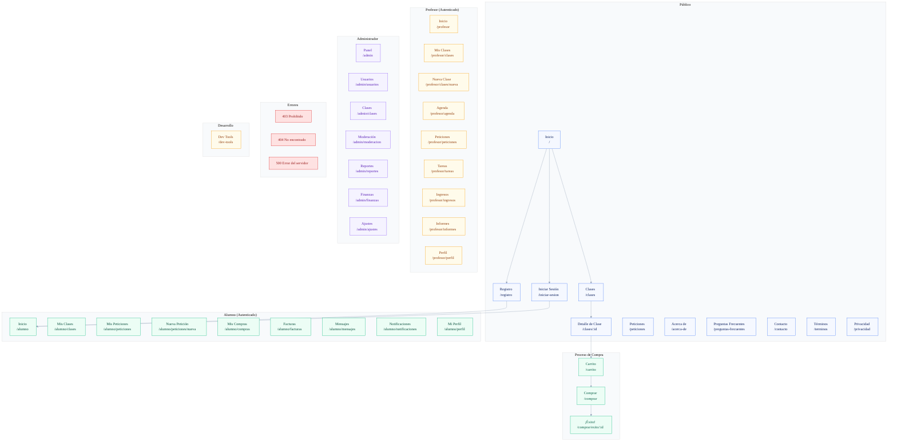

# 🗺️ Mapa de Navegación - AlenjandrIA

**Tu Biblioteca de Conocimiento Infinito**

Este documento describe la estructura completa de navegación de la aplicación.

## 📊 Diagrama Mermaid



## 📁 Estructura de Rutas

### 🌐 Área Pública
```
/                           # Inicio
/clases                     # Explorar clases
/clases/:id                 # Detalle de clase
/peticiones                 # Peticiones públicas
/acerca-de                  # Acerca de
/preguntas-frecuentes       # FAQ
/contacto                   # Contacto
/terminos                   # Términos y condiciones
/privacidad                 # Política de privacidad
/registro                   # Crear cuenta
/iniciar-sesion             # Iniciar sesión
```

### 🎓 Área Alumno
```
/alumno                     # Dashboard
/alumno/clases              # Mis clases
/alumno/clases/:id          # Detalle de clase
/alumno/peticiones          # Mis peticiones
/alumno/peticiones/nueva    # Nueva petición
/alumno/peticiones/:id      # Detalle de petición
/alumno/compras             # Mis compras
/alumno/compras/:id         # Detalle de compra
/alumno/facturas            # Facturas
/alumno/mensajes            # Mensajes
/alumno/chat/:id?           # Chat
/alumno/notificaciones      # Notificaciones
/alumno/perfil              # Mi perfil
```

### 👨‍🏫 Área Profesor
```
/profesor                       # Dashboard
/profesor/clases                # Mis clases
/profesor/clases/nueva          # Nueva clase
/profesor/clases/:id/editar     # Editar clase
/profesor/clases/:id/estadisticas # Estadísticas
/profesor/agenda                # Agenda
/profesor/sesiones              # Sesiones
/profesor/sesiones/:id          # Detalle de sesión
/profesor/peticiones            # Peticiones de alumnos
/profesor/peticiones/:id        # Responder petición
/profesor/tareas                # Tareas pendientes
/profesor/tareas/:id/calificar  # Calificar tarea
/profesor/informes              # Informes
/profesor/ingresos              # Ingresos
/profesor/retiros               # Retiros
/profesor/perfil                # Perfil
```

### ⚙️ Área Admin
```
/admin                      # Dashboard
/admin/usuarios             # Gestión de usuarios
/admin/usuarios/:id         # Detalle de usuario
/admin/clases               # Gestión de clases
/admin/moderacion           # Herramientas de moderación
/admin/reportes             # Reportes del sistema
/admin/finanzas             # Gestión financiera
/admin/ajustes              # Configuración
```

### 🛒 Checkout
```
/carrito                    # Carrito de compras
/comprar                    # Proceso de compra
/comprar/exito/:orderId     # Compra exitosa
```

### ❌ Páginas de Error
```
/403                        # Acceso prohibido
/404                        # Página no encontrada
/500                        # Error del servidor
```

### 🔧 Desarrollo
```
/dev-tools                  # Herramientas de desarrollo
```

## 🎨 Layouts

### PublicLayout
- **Ubicación**: `src/shared/ui/layouts/PublicLayout.tsx`
- **Usado en**: Todas las páginas públicas
- **Características**:
  - Header con navegación
  - Footer completo
  - Links a login/registro

### DashboardLayout
- **Ubicación**: `src/shared/ui/layouts/DashboardLayout.tsx`
- **Usado en**: Dashboards de Alumno, Profesor y Admin
- **Características**:
  - Sidebar con navegación contextual
  - Header con información de usuario
  - Responsive con menú móvil
  - Colores distintivos por rol:
    - Alumno: Verde (emerald)
    - Profesor: Ámbar (amber)
    - Admin: Violeta (violet)

## 🔐 Sistema de Permisos

| Ruta | Público | Alumno | Profesor | Admin |
|------|---------|---------|----------|-------|
| `/` | ✅ | ✅ | ✅ | ✅ |
| `/clases` | ✅ | ✅ | ✅ | ✅ |
| `/registro` | ✅ | ❌ | ❌ | ❌ |
| `/alumno/*` | ❌ | ✅ | ❌ | 👁️ |
| `/profesor/*` | ❌ | ❌ | ✅ | 👁️ |
| `/admin/*` | ❌ | ❌ | ❌ | ✅ |
| `/carrito` | ❌ | ✅ | ❌ | ❌ |

**Leyenda**:
- ✅ Acceso completo
- ❌ Acceso denegado
- 👁️ Solo lectura (Admin puede ver dashboards de otros roles)

## 📱 Navegación por Rol

### Alumno
```
🏠 Inicio → Dashboard con widgets
📚 Mis Clases → Clases matriculadas
📢 Peticiones → Solicitudes de clases
🛍️ Compras → Historial de compras
💬 Mensajes → Chat con profesores
🔔 Notificaciones → Centro de notificaciones
👤 Perfil → Información personal
```

### Profesor
```
🏠 Inicio → Dashboard con métricas
📚 Mis Clases → Clases publicadas
📅 Agenda → Calendario de sesiones
📢 Peticiones → Oportunidades de enseñanza
📝 Tareas → Calificaciones pendientes
💰 Ingresos → Gestión de pagos
📊 Informes → Reportes de progreso
👤 Perfil → Perfil profesional
```

### Admin
```
🏠 Inicio → Panel de control
👥 Usuarios → Gestión de usuarios
📚 Clases → Administrar clases
🛡️ Moderación → Herramientas de moderación
🚨 Reportes → Sistema de reportes
💰 Finanzas → Gestión financiera
⚙️ Ajustes → Configuración del sistema
```

## 🚀 Características Técnicas

### Lazy Loading
Todas las rutas utilizan `React.lazy()` para optimizar el bundle:
```typescript
const HomePage = lazy(() => import('./pages/public/HomePage').then(m => ({ default: m.HomePage })));
```

### Suspense
Todas las rutas están envueltas en Suspense con un componente de Loading:
```typescript
<Suspense fallback={<Loading label="Cargando..." />}>
  <Component />
</Suspense>
```

### Logs de Navegación
En modo desarrollo, cada cambio de ruta se registra en consola:
```typescript
if (import.meta.env.DEV) {
  console.log('📍 Ruta actual:', window.location.pathname);
}
```

## 🛠️ Herramientas de Desarrollo

Accede a `/dev-tools` para:
- 🔄 Cambiar entre roles fácilmente
- 📋 Ver índice completo de rutas
- 🔍 Buscar rutas por área o nombre
- 📊 Ver estadísticas de rutas por área

## 📝 Notas de Implementación

1. **Todas las páginas están implementadas** con componentes funcionales
2. **Tailwind CSS** para todos los estilos
3. **Sin estado global** (por ahora, pendiente de integración con backend)
4. **Mock UI** - Todas las interacciones son simuladas
5. **Accesibilidad** - Navegación por teclado y ARIA labels

## 🔜 Próximos Pasos

- [ ] Integrar autenticación real
- [ ] Conectar con backend
- [ ] Implementar guards de ruta por rol
- [ ] Agregar breadcrumbs dinámicos
- [ ] Implementar búsqueda global
- [ ] Agregar analytics de navegación
